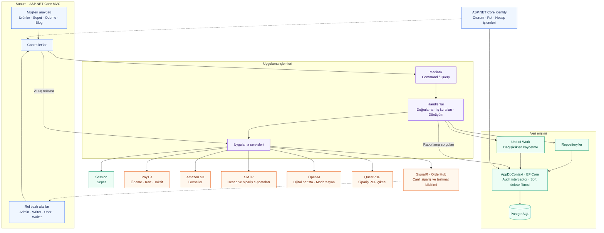
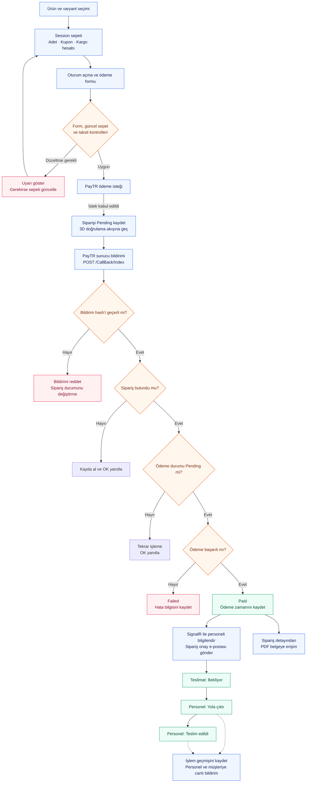

<div align="center">

# 🥐 MyAcademy_Bagery

### Yapay Zekâ Destekli Kafe, Pastane ve Online Sipariş Uygulaması


<br>

<p align="center">
  <strong>Ürün keşfinden ödemeye, sipariş yönetiminden canlı teslimat takibine.</strong>
</p>
<p align="center">
  <i>Menüye dayalı dijital barista, PayTR ödeme entegrasyonu, SignalR bildirimleri<br>
  ve farklı kullanıcı rollerine özel panellerle bütünleşen bir .NET 9 MVC projesi.</i>
</p>

</div>

---

**MyAcademy_Bagery**, bir kafe ve pastane işletmesinin dijital ürün sunumunu, çevrim içi sipariş sürecini ve günlük yönetim ihtiyaçlarını aynı uygulamada buluşturur. Müşteriler ürünleri ve seçeneklerini inceleyebilir, sepetlerine kupon uygulayabilir, ödemelerini tamamlayabilir ve siparişlerinin teslimat durumunu takip edebilir.

İşletme tarafında ise **ürün ve içerik yönetimi, satış analizleri, kullanıcı yetkilendirmesi ve teslimat operasyonu** ayrı paneller üzerinden yürütülür. OpenAI destekli dijital barista ve yorum moderasyonu, Amazon S3 görsel depolama, e-posta bildirimleri ve PDF sipariş çıktıları bu akışı tamamlar.

Proje geliştirilirken **MediatR ile komut–sorgu ayrımı, Repository ve Unit of Work, FluentValidation, Mapster ve merkezi hata işleme** gibi yaklaşımlar birlikte kullanılmıştır.

---

## 🌟 Projenin Öne Çıkan 8 Özelliği

### 🧠 1. Yapay Zekâ Destekli Dijital Barista ve Yorum Moderasyonu

Yapay zekâ entegrasyonu, müşterinin menüyü keşfetmesine ve blog yorumlarının yayın öncesinde değerlendirilmesine odaklanır.

- **Menüye Dayalı Yanıtlar:** Dijital baristaya veritabanındaki ürün adları, fiyatlar, açıklamalar, hazırlanış bilgileri ve kategoriler iletilir. Böylece sorular uygulamanın kendi menüsü bağlamında ele alınır.
- **Ürün Önerileri:** Bütçeye göre seçim ve yiyecek–içecek eşleştirmesi gibi taleplere yanıt üretilir. Modelin döndürdüğü ürün kimlikleri mevcut katalogla eşleştirilerek ilgili ürünler sunulur.
- **Kapsam Kontrolü:** Asistan, Bagery ve menüyle ilgili konulara yanıt verecek şekilde yapılandırılmıştır. Kapsam dışı olarak sınıflandırılan sorular için yönlendirici bir mesaj gösterilir.
- **Yorum Denetimi:** Blog yorumu kaydedilmeden önce içerik kontrol edilir. Uygunsuz olarak sınıflandırılan yorumlar kullanıcıya bilgi verilerek reddedilir.

### 🛒 2. Varyantlı Ürün Kataloğu ve Dinamik Sepet

Sipariş deneyimi; ürün seçimi, seçeneklerin fiyatlandırılması ve sepet toplamlarının hesaplanması üzerine kuruludur.

- **Ürün ve Varyant Yönetimi:** Kategoriler, ürünler ve ürün seçenekleri yönetilebilir. Varyantlara ek fiyat ve kullanılabilirlik bilgisi tanımlanabilir.
- **Session Tabanlı Sepet:** Ürün ekleme, adet güncelleme ve satır kaldırma işlemleri aynı sepet üzerinden yürütülür. Ürün ve varyant birlikte değerlendirilir.
- **Kupon ve Kargo Hesabı:** Kuponun aktifliği ve minimum sepet koşulu kontrol edilir; ürünler değiştikçe ara toplam, indirim ve kargo tutarı yeniden hesaplanır.
- **Ödeme Öncesi Güncellik:** Fiyatı değişen, kaldırılan veya seçeneği kullanılamayan ürünler ödeme öncesinde yeniden kontrol edilir. Gerekli durumlarda sepet güncellenir ve kullanıcı bilgilendirilir.

### 💳 3. PayTR ile Ödeme ve Taksit Entegrasyonu

Sepetten ödeme sonucuna kadar olan işlemler, uygulamadaki sipariş kayıtlarıyla ilişkilendirilmiştir.

- **Kartla Ödeme:** Ödeme formundaki bilgiler doğrulandıktan sonra PayTR isteği oluşturulur ve kullanıcı 3D doğrulama sürecine yönlendirilir.
- **Taksit Seçenekleri:** Kart bilgisine ve kayıtlı taksit oranlarına göre seçenekler hesaplanır. Seçilen taksitin tutara etkisi siparişe yansıtılır.
- **Sunucu Bildirimi:** Kesin ödeme durumu, PayTR'nin callback bildirimi üzerinden belirlenir. Gelen bildirimin hash değeri kontrol edilir; işlenmiş sipariş durumu yeniden işlenmeden yanıtlanır.
- **Sipariş Kaydı:** Ürün adı, varyant, adet, birim fiyat, kupon ve ödeme bilgileri sipariş anındaki değerleriyle saklanır.

### 📡 4. SignalR ile Canlı Sipariş ve Teslimat Takibi

Ödeme sonrasında sipariş, personelin takip edebildiği teslimat sürecine geçer. Müşteri ve personel ekranları aynı siparişin güncel durumunu izler.

- **Anlık Sipariş Bildirimi:** Ödenmiş sipariş bilgisi SignalR üzerinden personel grubuna iletilir.
- **Aşamalı Teslimat:** Siparişler **Bekliyor → Yolda → Teslim edildi** durumlarıyla takip edilir. Teslimat ilerletme işlemi için ödemenin tamamlanmış olması gerekir.
- **Müşteriye Özel Takip:** Kullanıcı, kendisine ait siparişin bildirim grubuna katılarak durum değişikliklerini izleyebilir. Gruba katılmadan önce sipariş sahipliği kontrol edilir.
- **İşlem Geçmişi ve Geri Alma:** Yapılan teslimat işlemleri kaydedilir. Garson son adımı beş dakika içinde geri alabilir; admin için bu süre kısıtı uygulanmaz. Geri alma işlemi de geçmişe ve bildirimlere yansır.

### 🔐 5. Identity, Google Girişi ve Rol Bazlı Paneller

Hesap işlemleri ASP.NET Core Identity üzerinden yürütülür; kullanıcıların erişebildiği ekranlar rollerine göre ayrılır.

- **Hesap Yaşam Döngüsü:** Kayıt, giriş, e-posta doğrulama, şifre yenileme ve profil güncelleme akışları bulunur.
- **Google ile Giriş:** Kullanıcılar Google hesapları üzerinden oturum açabilir.
- **Rol Bazlı Erişim:** `Admin`, `Writer`, `User` ve `Waiter` alanları farklı sorumluluklara göre düzenlenmiştir. Oturum yönetiminde cookie tabanlı kimlik doğrulama kullanılır.
- **Hesap Kontrolleri:** Tekil e-posta, şifre kuralları ve başarısız giriş denemelerinde hesap kilitleme ayarları uygulanır.

### ☁️ 6. Amazon S3 ile Görsel Depolama

Yüklenen görseller, uygulamanın dosya servisi üzerinden Amazon S3 üzerinde yönetilir.

- **Merkezi Yükleme:** Görseller S3 bucket'ına aktarılır ve oluşan adres ilgili kayıtta kullanılır.
- **Benzersiz Dosya Adları:** Yükleme sırasında dosya adına benzersiz bir kimlik eklenir.
- **URL Üzerinden Sunum:** Arayüzde kullanılan görseller S3 adresleri üzerinden görüntülenir.
- **Dosya Yönetimi:** Yükleme ve silme işlemleri `IFileService` arayüzü üzerinden ortak bir serviste toplanır.

### 📬 7. E-posta Bildirimleri ve PDF Sipariş Belgesi

Hesap ve sipariş süreçleri, kullanıcıya gönderilen bilgilendirmelerle desteklenir.

- **Hesap E-postaları:** E-posta doğrulama ve şifre yenileme işlemlerinde MailKit/MimeKit tabanlı servis kullanılır.
- **Sipariş Onayı:** Başarılı ödeme sonrasında sipariş bilgilerini içeren e-posta gönderilir. Temel adres yapılandırıldığında e-postaya belge bağlantısı da eklenir.
- **Dinamik PDF:** QuestPDF ile sipariş bilgilerini içeren PDF çıktısı oluşturulur; belge tarayıcıda görüntülenebilir veya indirilebilir.
- **Siparişe Bağlı Erişim:** Kişisel PDF sorgusunda kullanıcı sahipliği ve siparişin ödenmiş olması kontrol edilir.

### 📊 8. Satış Analizleri ve İçerik Yönetimi

Yönetim paneli, işletmenin sipariş hareketlerini ve sitede yayınlanan içerikleri bir arada yönetmesine olanak tanır.

- **Dönemsel Satış Analizi:** 7, 30, 90 ve 365 günlük dönemler için satış tutarı, ortalama sepet ve sipariş durumları görüntülenir; önceki dönemle karşılaştırma yapılır.
- **Ürün ve Kategori Performansı:** Günlük satışlar, saatlik sipariş dağılımı, kategori gelirleri, en çok ve en az satan ürünler incelenebilir.
- **Ödeme ve Kupon Görünümü:** Tek çekim/taksit dağılımı, kart aileleri ve kupon kullanımı raporlanır.
- **Dinamik İçerikler:** Blog, yorum, banner, tanıtım, işletme geçmişi, referans, müşteri görüşü ve iletişim içerikleri yönetilebilir. Yazarlar için ayrı içerik ekranları bulunur.

---

## 🏗️ Mimari ve Tasarım Yaklaşımı

MyAcademy_Bagery, **tek bir ASP.NET Core MVC projesi içinde sorumlulukları ayrıştırılmış** bir yapıya sahiptir. Sunum tarafı Controller, Razor View ve View Component yapılarıyla; uygulama işlemleri ise MediatR komutları, sorguları ve handler'larıyla düzenlenmiştir.

| Yapı / Konsept | Projedeki Kullanımı |
| :--- | :--- |
| **Web Uygulaması** | .NET 9, ASP.NET Core MVC, Razor Views ve View Components |
| **Komut ve Sorgu Ayrımı** | MediatR ile Command / Query / Handler organizasyonu |
| **Veri Erişimi** | EF Core 9, Npgsql ve PostgreSQL |
| **Veri İşlemleri** | Generic Repository ve Unit of Work |
| **Doğrulama** | FluentValidation ile ayrı validator sınıfları |
| **Nesne Eşleme** | Mapster ile model ve entity dönüşümleri |
| **Bağımlılık Yönetimi** | Dependency Injection ve Scrutor ile repository kayıtları |
| **Veri Yaşam Döngüsü** | AuditDbContextInterceptor, zaman damgaları ve soft delete |
| **Hata İşleme** | Özel exception türleri ve ortak ExceptionFilter |
| **Kimlik ve Yetki** | ASP.NET Core Identity, cookie oturumu ve Google Authentication |
| **Arayüz Bileşenleri** | Bootstrap, jQuery, SweetAlert2 ve ApexCharts |

### 📨 MediatR ile Komut ve Sorgu Ayrımı

Controller'lardan gelen istekler, ilgili komut veya sorgu nesnesiyle handler'a aktarılır. Veri değiştiren işlemler `Commands`, okuma işlemleri `Queries`, bunların uygulamaları `Handlers` altında toplanır. Bu düzen, bir işlevin doğrulama ve iş kurallarının nerede yürütüldüğünü takip etmeyi kolaylaştırır.

### 🗃️ Generic Repository ve Unit of Work

Ortak ekleme, okuma, güncelleme ve silme işlemleri Generic Repository üzerinden sunulur. Modüle özgü sorgular ilgili repository'lerde yer alır. Unit of Work, aynı `AppDbContext` üzerinde biriken değişiklikleri `SaveChangesAsync` çağrısıyla kaydeder. Bazı raporlama handler'ları da doğrudan `AppDbContext` üzerinden sorgu çalıştırır.

### 🛡️ Interceptor ile Kayıt Takibi ve Soft Delete

`AuditDbContextInterceptor`, `BaseEntity` türevi kayıtların eklenme ve güncellenme zamanlarını yönetir. Silme işlemleri bu kayıtlarda `IsDeleted` alanını güncelleyecek şekilde dönüştürülür. `AppDbContext` üzerindeki global sorgu filtresi, silinmiş kayıtları normal sorgu sonuçlarından çıkarır.

### ✅ FluentValidation ve Merkezi Hata İşleme

Form ve işlem doğrulamaları validator sınıflarında tanımlanır. `ExceptionFilter`, tanımlı doğrulama, Identity ve iş kuralı hatalarını yakalar; normal sayfa isteklerinde `ModelState` üzerinden, AJAX olarak işaretlenen isteklerde JSON yanıtıyla kullanıcıya iletir.

### ⚙️ Scrutor ve Mapster

Scrutor, assembly içindeki repository sınıflarını tarayarak arayüzleri üzerinden dependency injection yapısına kaydeder. Mapster ise model–entity eşlemelerinde tekrarlanan alan atamalarını azaltır. Diğer uygulama servisleri servis kayıt uzantılarında tanımlanır.

---

## 👥 Kullanıcı Rolleri ve Yönetim Alanları

| Rol / Alan | Yetki ve İşlevler |
| :--- | :--- |
| **Ziyaretçi** | Ürün ve blog inceleme, sepet oluşturma, iletişim ve hesap ekranlarına erişim. |
| **User** | Profil ve şifre yönetimi, kendi siparişlerini görüntüleme, teslimat takibi ve ödenmiş siparişin PDF çıktısına erişim. |
| **Writer** | Kendi blog ve yorumlarını yönetme; yazar paneli, profil ve kişisel sipariş ekranlarını kullanma. |
| **Waiter** | Teslimat panosunu izleme, sipariş durumunu ilerletme ve izin verilen süre içinde son adımı geri alma. |
| **Admin** | Ürün, kategori, varyant, kullanıcı, rol, içerik, kupon, taksit, sipariş ve teslimat yönetimi; satış panolarına erişim. |

Ödeme için oturum açılması gerekir. Blog yorumu oluşturma işlemi **Admin** ve **Writer** rollerine açıktır. Kişisel sipariş ve belge erişimleri kullanıcı sahipliğine göre kontrol edilir.

---

## 🔌 Entegrasyonlar

| Entegrasyon | Uygulamaya Katkısı |
| :--- | :--- |
| **OpenAI** | Menüye dayalı dijital barista ve yayın öncesi yorum moderasyonu. |
| **PayTR** | Kartla ödeme, kart bilgisi sorgulama, taksit işlemleri ve ödeme sonucu bildirimi. |
| **SignalR** | Ödenmiş sipariş ve teslimat değişikliklerinin bağlı ekranlara iletilmesi. |
| **Amazon S3** | Görsellerin bulutta saklanması ve URL üzerinden sunulması. |
| **Google Authentication** | Google hesabıyla oturum açılması. |
| **Gmail SMTP / MailKit** | Hesap doğrulama, şifre yenileme ve sipariş e-postaları. |
| **QuestPDF** | Sipariş verilerinden görüntülenebilir ve indirilebilir PDF oluşturulması. |

---


## 🔄 Mimari ve Proje Akışları

### 🏛️ Uygulama Mimarisi

Controller, MediatR, veri erişimi ve dış servislerin uygulama içindeki ilişkisi aşağıdaki diyagramda gösterilmiştir.

<details>
<summary><b>Mimari Diyagramını Görmek İçin Tıklayın</b></summary>



</details>

### 🛍️ Siparişten Teslimata

Müşteri ürününü seçer, sepetini düzenler ve ödeme işlemini başlatır. PayTR bildirimiyle ödeme durumu güncellenir; başarılı ödeme sonrasında personel bilgilendirilir ve teslimat takibi başlar. **Ödeme durumu ile teslimat durumu ayrı olarak yönetilir.**

<details>
<summary><b>Ödeme ve Teslimat Akışını Görmek İçin Tıklayın</b></summary>



</details>

### 📂 Proje Organizasyonu

<details>
<summary><b>Klasör Yapısını Görmek İçin Tıklayın</b></summary>

```text
MyAcademy_Bagery/
└── Bagery.WebUI/
    ├── Areas/                 # Admin, Writer, User ve Waiter alanları
    ├── Controllers/           # Genel site, hesap, sepet ve ödeme uç noktaları
    ├── Context/               # EF Core ve Identity veritabanı bağlamı
    ├── Entities/              # Veritabanı varlıkları
    ├── Enums/                 # Ödeme, teslimat ve mesaj durumları
    ├── Exceptions/            # Uygulamaya özgü hata türleri
    ├── Extensions/            # Servis kayıtları ve yardımcı genişletmeler
    ├── Filters/               # Ortak hata işleme
    ├── Hubs/                  # SignalR OrderHub
    ├── IdentityValidations/   # Identity hata mesajları
    ├── Interceptors/          # Audit ve soft delete işlemleri
    ├── MediatorPattern/       # Commands, Queries, Handlers ve Results
    ├── Migrations/            # Veritabanı şema değişiklikleri
    ├── Models/                # Sepet, form ve yardımcı modeller
    ├── Repositories/          # Veri erişim arayüzleri ve uygulamaları
    ├── Services/              # Ödeme, e-posta, dosya, PDF, AI ve bildirimler
    ├── UOW/                   # Unit of Work
    ├── Validators/            # FluentValidation kuralları
    ├── ViewComponents/        # Tekrar kullanılabilir arayüz bileşenleri
    ├── Views/                 # Razor sayfaları ve ortak yerleşimler
    ├── wwwroot/               # Tema dosyaları ve statik varlıklar
    └── Program.cs             # Uygulamanın başlangıç ve yönlendirme ayarları
```

</details>

---

## 📸 Ekran Görüntüleri ve Kullanım Senaryoları

<!-- GÖRSEL EKLEME: Her bölümdeki img satırları hazırdır. Görseli docs/images/ altına koyabilir veya src değerini GitHub'a yüklediğin görsel bağlantısıyla değiştirebilirsin. Ardından ilgili img satırının çevresindeki yorum işaretlerini kaldır. Fotoğrafları ekledikten sonra 'Görsel alanı' satırlarını silebilirsin. -->

### 🏠 Ana Sayfa ve İşletme Vitrini

<details>
<summary><b>Ana Sayfa Görsellerini Görmek İçin Tıklayın</b></summary>
<br>

> Ziyaretçileri karşılayan ürün sunumları, tanıtım alanları, işletme bilgileri ve dinamik içerikler.

**📷 Görsel alanı — Ana sayfa üst bölüm**

<!--  -->

**📷 Görsel alanı — Ana sayfa ürün ve tanıtım alanları**

<!--  -->

**📷 Görsel alanı — İşletme içerikleri ve alt bölüm**

<!--  -->

</details>

---

### 🥐 Ürün Kataloğu ve Varyant Seçimi

<details>
<summary><b>Ürün Ekranlarını Görmek İçin Tıklayın</b></summary>
<br>

> Müşterinin ürünleri incelediği, ürün detaylarına ulaştığı ve uygun varyantı seçerek sepetine eklediği süreç.

**📷 Görsel alanı — Ürün kataloğu**

<!--  -->

**📷 Görsel alanı — Ürün detay sayfası**

<!--  -->

**📷 Görsel alanı — Ürün varyantları ve fiyatları**

<!--  -->

</details>

---

### 🛒 Sepet, Kupon ve Tutar Hesaplama

<details>
<summary><b>Sepet ve Kupon Görsellerini Görmek İçin Tıklayın</b></summary>
<br>

> Sepet kalemleri, adet değişiklikleri, kupon uygulaması ve kargo dahil ödeme özetinin gösterildiği ekranlar.

**📷 Görsel alanı — Sepet ve tutar özeti**

<!--  -->

**📷 Görsel alanı — Kupon uygulaması**

<!--  -->

</details>

---

### 💳 PayTR Ödeme ve Taksit Süreci

<details>
<summary><b>Ödeme Akışını Görmek İçin Tıklayın</b></summary>
<br>

> Ödeme bilgilerinin girilmesi, taksit seçeneklerinin görüntülenmesi, 3D doğrulama ve ödeme sonucunun kullanıcıya sunulması.

**📷 Görsel alanı — Ödeme formu**

<!--  -->

**📷 Görsel alanı — Taksit seçenekleri**

<!--  -->

**📷 Görsel alanı — Ödeme sonuç ekranı**

<!--  -->

</details>

---

### 📦 Siparişlerim ve Canlı Teslimat Takibi

<details>
<summary><b>Sipariş Takip Ekranlarını Görmek İçin Tıklayın</b></summary>
<br>

> Kullanıcının kendi sipariş geçmişini incelediği ve sipariş detayından güncel teslimat durumunu takip ettiği alan.

**📷 Görsel alanı — Kişisel sipariş listesi**

<!--  -->

**📷 Görsel alanı — Sipariş detayları**

<!--  -->

**📷 Görsel alanı — Canlı teslimat durumu**

<!--  -->

</details>

---

### 📬 Sipariş E-postası ve PDF Çıktısı

<details>
<summary><b>E-posta ve PDF Örneklerini Görmek İçin Tıklayın</b></summary>
<br>

> Başarılı ödeme sonrasında gönderilen sipariş onayı ve QuestPDF ile oluşturulan sipariş belgesinin görünümü.

**📷 Görsel alanı — Sipariş onay e-postası**

<!--  -->

**📷 Görsel alanı — PDF sipariş belgesi**

<!--  -->

</details>

---

### 🤖 Dijital Barista ve Ürün Önerileri

<details>
<summary><b>Yapay Zekâ Ekranlarını Görmek İçin Tıklayın</b></summary>
<br>

> Menü hakkında soru sorma, bütçeye uygun ürün seçimi ve yiyecek–içecek önerilerini inceleme deneyimi.

**📷 Görsel alanı — Dijital barista sohbet ekranı**

<!--  -->

**📷 Görsel alanı — Menüye dayalı ürün önerileri**

<!--  -->

</details>

---

### 🔑 Kayıt, Giriş ve Hesap Doğrulama

<details>
<summary><b>Hesap İşlemlerini Görmek İçin Tıklayın</b></summary>
<br>

> Kullanıcı kaydı, e-posta doğrulaması, Google ile giriş ve şifre yenileme adımları.

**📷 Görsel alanı — Kayıt formu**

<!--  -->

**📷 Görsel alanı — Giriş ve Google ile oturum açma**

<!--  -->

**📷 Görsel alanı — E-posta doğrulama ekranı**

<!--  -->

**📷 Görsel alanı — Şifre yenileme ekranı**

<!--  -->

</details>

---

### ✍️ Blog, Yazar Paneli ve Yorum Moderasyonu

<details>
<summary><b>Blog ve Yazar Ekranlarını Görmek İçin Tıklayın</b></summary>
<br>

> Blog içerikleri, yazarın kendi yazılarını yönetmesi ve uygunsuz olarak sınıflandırılan yorumlara verilen geri bildirim.

**📷 Görsel alanı — Blog detay sayfası**

<!--  -->

**📷 Görsel alanı — Yazar yönetim paneli**

<!--  -->

**📷 Görsel alanı — Yorum moderasyonu geri bildirimi**

<!--  -->

</details>

---

### 📊 Satış Analizleri ve Yönetim Özeti

<details>
<summary><b>Dashboard Görsellerini Görmek İçin Tıklayın</b></summary>
<br>

> Dönemsel satış göstergeleri, ürün performansı, kategori dağılımları ve kupon kullanımına ait yönetim ekranları.

**📷 Görsel alanı — Satış dashboard genel görünüm**

<!--  -->

**📷 Görsel alanı — Ürün ve kategori performansı**

<!--  -->

**📷 Görsel alanı — Site genel görünüm paneli**

<!--  -->

</details>

---

### 🛠️ Admin Yönetim Paneli

<details>
<summary><b>Yönetim Ekranlarını Görmek İçin Tıklayın</b></summary>
<br>

> Ürün, kategori, varyant, kullanıcı, rol, kupon, taksit oranı ve site içeriklerinin yönetildiği alanlar.

**📷 Görsel alanı — Ürün yönetimi**

<!--  -->

**📷 Görsel alanı — Varyant yönetimi**

<!--  -->

**📷 Görsel alanı — Kullanıcı ve rol yönetimi**

<!--  -->

**📷 Görsel alanı — Kupon yönetimi**

<!--  -->

**📷 Görsel alanı — İçerik ve iletişim yönetimi**

<!--  -->

</details>

---

### 🚚 Garson Panosu ve Teslimat Operasyonu

<details>
<summary><b>Teslimat Panosunu Görmek İçin Tıklayın</b></summary>
<br>

> Ödenmiş siparişlerin personel tarafından izlenmesi, teslimat durumunun güncellenmesi ve işlem geçmişinin incelenmesi.

**📷 Görsel alanı — Garson teslimat panosu**

<!--  -->

**📷 Görsel alanı — Teslimat durum güncellemesi**

<!--  -->

**📷 Görsel alanı — Teslimat işlem geçmişi**

<!--  -->

</details>

---

## ⚙️ Kurulum

<details>
<summary><b>Gereksinimleri ve Yerel Kurulum Adımlarını Görmek İçin Tıklayın</b></summary>

### Gereksinimler

- .NET 9 SDK ve PostgreSQL.
- .NET 9 ile uyumlu geliştirme ortamı.
- Veritabanı migration'larını uygulamak için EF Core 9 araçları.
- İlgili özellikler için Google OAuth, Amazon S3, SMTP, PayTR ve OpenAI erişim bilgileri.

### 1. Bağımlılıkları yükleme

Depoyu indirdikten veya klonladıktan sonra `Bagery.WebUI` klasöründe çalıştırın:

```bash
dotnet restore
```

### 2. Yapılandırma

Proje User Secrets kullanımına uygun olarak tanımlanmıştır. Geliştirme ortamına ait değerleri User Secrets üzerinden tanımlayabilirsiniz. Gerçek erişim anahtarlarını ve şifreleri depoya eklemeyin.

| Ayar anahtarı | Kullanım |
| --- | --- |
| `ConnectionStrings:PostgreSQL` | PostgreSQL bağlantı bilgisi |
| `Authentication:Google:ClientId` | Google OAuth istemci kimliği |
| `Authentication:Google:ClientSecret` | Google OAuth istemci sırrı |
| `AWS:AccessKey` | S3 erişim anahtarı |
| `AWS:SecretKey` | S3 gizli erişim anahtarı |
| `AWS:BucketName` | Görsellerin saklanacağı bucket |
| `Email:Admin` | Gönderici e-posta hesabı |
| `Email:Code` | SMTP kimlik doğrulaması için kullanılan şifre |
| `PayTR:merchantId` | PayTR mağaza kimliği |
| `PayTR:merchantKey` | PayTR mağaza anahtarı |
| `PayTR:merchantSalt` | PayTR hash işlemlerinde kullanılan değer |
| `PayTR:testMode` | Test modu ayarı |
| `PayTR:debugOn` | PayTR hata ayıklama ayarı |
| `PayTR:baseUrl` | Sipariş e-postasındaki belge bağlantısının temel adresi |
| `OpenAI:ApiKey` | Dijital barista ve yorum moderasyonu erişim anahtarı |

Örnek bağlantı tanımı; değerleri kendi ortamınıza göre değiştirin:

```bash
dotnet user-secrets set "ConnectionStrings:PostgreSQL" "Host=localhost;Port=5432;Database=BageryDb;Username=YOUR_USER;Password=YOUR_PASSWORD"
```

Mevcut e-posta servisi `smtp.gmail.com:587`, S3 kaydı ise `eu-north-1` bölgesini kullanır. Servis hesaplarının yapılandırması bu uygulama ayarlarıyla uyumlu olmalıdır.

### 3. Veritabanını hazırlama

EF Core aracı kurulu değilse uyumlu bir 9.x sürümünü yükleyin. Ardından mevcut migration'ları uygulayın:

```bash
dotnet ef database update
```

İlk kurulumda `Admin`, `Writer`, `User` ve `Waiter` rollerinin ve ilk yönetici hesabının hazırlanması gerekir. Kaynak kodda başlangıçta bunları otomatik oluşturan bir seed akışı bulunmaz; kayıt işlemi mevcut `User` rolüne atama yapar. Migration'ların uygulanması tek başına kullanıma hazır demo hesapları oluşturmaz.

### 4. Uygulamayı başlatma

```bash
dotnet run --launch-profile https
```

HTTPS profili uygulamayı `https://localhost:7152` adresinde başlatacak şekilde tanımlıdır.

PayTR ödeme sonucunun alınabilmesi için mağaza panelindeki bildirim adresi, dışarıdan erişilebilen uygulama adresinin **`/CallBack/Index`** yoluna yönlendirilmelidir. Bu sunucu bildirimi, tarayıcının başarı veya başarısızlık sayfasına dönüşünden ayrı çalışır.

</details>

---

<div align="center">

## 💬 Proje ve İletişim

Projenin geliştirme süreci ve teknik detayları hakkında iletişime geçebilirsiniz.

<a href="https://www.linkedin.com/in/burakhanulusoy/">
  
</a>

<br>
<br>

**🥐 MyAcademy_Bagery · ASP.NET Core MVC ile ürün, sipariş ve teslimat yönetimi**

</div>
